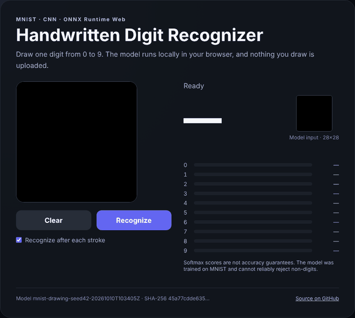
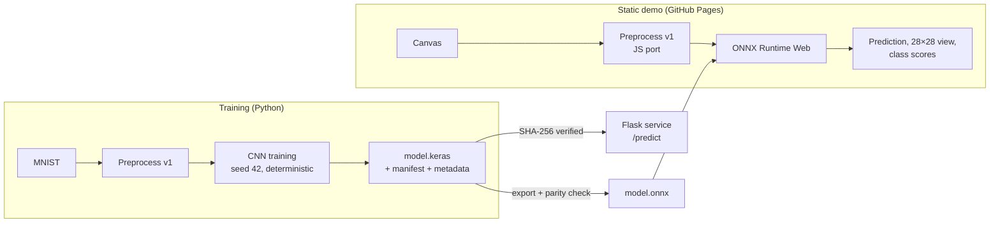

# MNIST Digit Recognizer

**A handwritten digit recognizer that runs entirely in the browser, backed by a reproducible TensorFlow training pipeline, a verified Flask inference service, and honest evaluation.**

[](https://github.com/MapleSugarMochi/MNIST/actions/workflows/ci.yml)
[](https://github.com/MapleSugarMochi/MNIST/actions/workflows/pages.yml)

[](LICENSE)

### [▶ Try the live demo](https://maplesugarmochi.github.io/MNIST/)

Draw a digit, and the CNN classifies it in a few milliseconds with ONNX Runtime Web. No server is involved, and nothing you draw leaves your device. The demo shows the exact 28×28 image the model sees and the score for every class.

<p align="center">
  
</p>

## Highlights

- **99.24% accuracy** on the full 10,000-image MNIST test set, through the same preprocessing used for canvas drawings. Expected calibration error is 0.0012.
- **Serverless browser inference.** The Keras model is exported to ONNX (opset 17) and checked against Keras on all 10,000 test images: argmax agreement is 100%, and the maximum probability difference is 1.3 × 10⁻⁶.
- **One preprocessing contract, pixel-exact on two runtimes.** The Python pipeline (crop, Lanczos resize, center-of-mass alignment) is ported to JavaScript, including Pillow's fixed-point Lanczos resampling. CI checks the port against 340 fixtures generated in Python.
- **Reproducible training.** The pipeline uses a stratified split, fixed seeds, deterministic TensorFlow ops, and `val_loss`-based checkpointing. It records runtime, data, and split hashes. Retraining in the same environment reproduces bit-identical weights.
- **Verified model identity.** The service refuses to load a model whose SHA-256 or preprocessing version doesn't match its manifest. It warms up and validates the model's outputs, and reports exactly which model answered each request.
- **Production-minded service.** Separate liveness and readiness checks, input limits, JSON errors, a packaged wheel that runs outside the checkout, hash-locked dependencies, and checksummed release bundles.
- **Honest evaluation.** Synthetic canvas tests are labeled as synthetic. Tooling for collecting and evaluating human handwriting, split by writer, is built in. Confidence thresholds are opt-in and must be fit on human validation data.

## How it works



Every path uses the same versioned preprocessing, `white-ink-crop20-mass-center28-v1`:

1. Composite onto black and convert to grayscale.
2. Crop to the visible strokes (pixels brighter than 20).
3. Resize so the longer side is 20 px, using Lanczos resampling.
4. Paste into a 28×28 frame, then shift so the center of mass sits in the middle, as in the original MNIST preparation.
5. Normalize to `[0, 1]`.

## Results

Each row uses all 10,000 MNIST test images. Synthetic canvases render test digits onto a 280×280 canvas and pass them through the serving pipeline. They measure robustness to controlled transformations, not accuracy on human handwriting.

| Input condition | Accuracy |
| --- | ---: |
| MNIST, normalization only | 99.23% |
| MNIST, serving preprocessing | **99.24%** |
| Synthetic canvas, regular | 99.24% |
| Synthetic canvas, small and offset | 99.26% |
| Synthetic canvas, thick strokes and 12° tilt | 98.58% |
| Synthetic canvas, thin strokes | 99.18% |

The [model card](reports/model-card.md) covers training details, per-class results, the most common confusions (9 → 4, 5 → 3), latency, and limitations. Raw metrics are in [`reports/evaluation.json`](reports/evaluation.json) and [`reports/benchmark.json`](reports/benchmark.json).

## Quick start

### Run the browser demo locally

```bash
npm ci --prefix demo                    # vendors ONNX Runtime Web
python scripts/build_site.py            # assembles _site/ and checks the model is current
python -m http.server --directory _site 8000
```

Then open <http://localhost:8000>.

### Run the Flask service

Requires Python 3.11–3.13. The bundled model loads by default, so no training is needed.

```bash
git clone https://github.com/MapleSugarMochi/MNIST.git
cd MNIST
python -m venv .venv
source .venv/bin/activate              # Windows: .venv\Scripts\Activate.ps1
python -m pip install --require-hashes -r requirements.lock
python -m pip install --no-deps --no-build-isolation -e .
python app.py                          # http://127.0.0.1:5000
```

For a production-style server, run `waitress-serve --host=127.0.0.1 --port=5000 mnist_web.app:app`. Once installed, the app also starts with `mnist-web`.

## API

| Endpoint | Purpose |
| --- | --- |
| `GET /health` | Liveness. Does not require the model. |
| `GET /ready` | Loads, verifies, and warms the model, then returns its identity. |
| `POST /predict` | Classifies `{"image": "data:image/png;base64,..."}`. |
| `GET /collect` | Opens a page for collecting labeled human handwriting. |

A successful prediction returns:

```json
{
  "prediction": 7,
  "confidence": 0.999999,
  "top3": [{"digit": 7, "confidence": 0.999999}, {"digit": 9, "confidence": 0.000001}, {"digit": 3, "confidence": 0.0}],
  "uncertain": null,
  "confidence_threshold": null,
  "model": {"id": "mnist-drawing-seed42-20261010T103405Z", "sha256": "45a77cdd…", "preprocessing_version": "white-ink-crop20-mass-center28-v1"}
}
```

Errors return JSON:

| Status | Cause |
| ---: | --- |
| 400 | Malformed input, a non-PNG image, an empty canvas, or an image side over 2048 px |
| 413 | Request body over 2 MiB |
| 503 | Model loading or inference failed |

### Configuration

| Variable | Effect |
| --- | --- |
| `MNIST_MODEL_PATH` | Serve another model. Its `.manifest.json` must sit next to it. |
| `MNIST_MODEL_SHA256` | Pin an expected model hash. |
| `MNIST_CALIBRATION_PATH` | Enable a confidence threshold fit on human validation data for this exact model. |
| `PORT` | Listening port. Defaults to 5000. |
| `FLASK_DEBUG` | Enables the debugger when set to `1`. |

## Training, evaluation, and export

```bash
# Train. Writes model.keras, manifest, metadata, and split indices to artifacts/.
python model.py --output artifacts/model.keras --epochs 20 --batch-size 128 --seed 42

# Evaluate on MNIST and synthetic canvases (add --model to evaluate another artifact).
python -m mnist_web.evaluation --output reports/local/evaluation.json

# Measure warm latency.
python -m mnist_web.benchmark --output reports/local/benchmark.json

# Export the browser model. Requires optional tools; see requirements-export.txt.
python -m pip install --no-deps -r requirements-export.txt
python scripts/export_onnx.py
```

Human evaluation works like this:

1. Collect drawings at `/collect`, giving each one its true label and an anonymous writer ID.
2. Export one validation corpus and one test corpus, written by different people.
3. Run the evaluation:

```bash
python -m mnist_web.evaluation --canvas-validation datasets/validation.json \
  --canvas-test datasets/test.json --calibration-output artifacts/calibration.json
```

The evaluator rejects duplicate drawings and writer overlap between the two corpora. A threshold is selected only if it keeps at least 30 validation samples at 95% or higher empirical accuracy.

## Testing and CI

```bash
python -m ruff check .
python -m pytest                       # API, preprocessing, real-model inference, training
                                       # reproducibility, release integrity, ONNX export
node --test tests/frontend.test.cjs    # canvas behavior + JS/Python preprocessing parity
python -m build --no-isolation
```

- **[CI](.github/workflows/ci.yml)** runs lint, Python and frontend tests, the wheel and sdist build, an install check outside the checkout, and the static demo build. It covers Windows and Linux with Python 3.11 and 3.13.
- **[Pages](.github/workflows/pages.yml)** deploys the demo on every relevant push to `main`.
- **[Release bundle](.github/workflows/release.yml)** evaluates the model and packages the model, report, lock file, and `SHA256SUMS`.

## Project structure

```text
mnist_web/
  app.py            Flask API: input validation, verified model loading, warm inference
  preprocessing.py  Versioned preprocessing shared by training, evaluation, and serving
  training.py       Reproducible training with provenance metadata
  evaluation.py     MNIST, synthetic-canvas, and human-canvas evaluation; threshold selection
  benchmark.py      Warm latency and concurrency measurement
  artifacts.py      Model hashing, manifests, identity checks
  release.py        Checksummed model bundles
  assets/           Pinned model, manifest, and training metadata
  static/, templates/  Flask UI and sample collection page
demo/               Static browser demo: JS preprocessing port, ONNX model, UI
scripts/            ONNX export, site build, installed-wheel check
tests/              Python and Node tests, plus parity fixtures
reports/            Model card, evaluation, and benchmark results
```

## Limitations and roadmap

- **No human evaluation yet.** Accuracy on human handwriting is unmeasured. Collecting a writer-split corpus with `/collect` is the next step.
- **Non-digits aren't rejected.** Softmax scores do not reliably reject non-digits. Candidate fixes are an energy-based out-of-distribution score or a trained "not a digit" class.
- **Thick, slanted strokes are the weakest condition** (98.58%). Stroke-width augmentation should close part of the gap.
- **Concurrent requests queue up.** The Flask service runs inference behind a lock. Request batching would raise throughput under load.

## License

[MIT](LICENSE)
