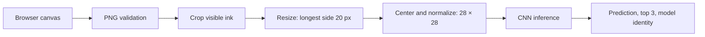

# MNIST · Handwritten Digit Recognition

[English](README.md) · [简体中文](README.zh-CN.md)

A handwritten digit recognition application built with TensorFlow/Keras and Flask, with an interactive drawing canvas, a pretrained CNN, and tooling for training, evaluation, and model packaging.

Write a single digit in the browser and inspect its prediction and three highest model scores. The repository includes the model and web assets needed to run locally, alongside versioned preprocessing, evaluation reports, automated tests, and distribution workflows.

| At a glance | Details |
| --- | --- |
| Task | Classification of individual handwritten digits, 0–9 |
| Model | Two convolutional blocks and a 10-class Softmax output |
| Recorded MNIST accuracy | **99.21%** on the full 10,000-image test set |
| Runtime | Python 3.11–3.13; TensorFlow/Keras; Flask |
| Delivery | Python wheel, source distribution, and checksummed model bundle |
| License | [MIT](LICENSE) |

## Quick start

Use Python 3.11–3.13. The application loads the bundled model; training is optional.

```bash
git clone https://github.com/MapleSugarMochi/MNIST.git
cd MNIST
python -m venv .venv
```

Activate the environment on Windows PowerShell:

```powershell
.venv\Scripts\Activate.ps1
```

Or on Linux/macOS:

```bash
source .venv/bin/activate
```

Install the hash-locked dependencies and the application:

```bash
python -m pip install --require-hashes -r requirements.lock
python -m pip install --no-deps --no-build-isolation -e .
python app.py
```

Open [http://127.0.0.1:5000](http://127.0.0.1:5000), draw one digit, and select the recognition button. The interface currently uses Chinese labels and supports mouse, touch, and stylus input.

The installed `mnist-web` command also starts the application. A wheel includes the model, templates, and static assets, so the command can run outside the source directory. CI covers Windows and Linux; macOS is outside the current CI matrix.

## Capabilities and inference pipeline

- **Interactive inference:** ranked predictions and model scores. Drawing pauses while a request is pending; a 15-second timeout restores the controls.
- **Consistent input processing:** crop visible ink, preserve aspect ratio when resizing, center by pixel mass, and normalize.
- **Verified model identity:** check the model SHA-256, warm inference, validate the output, and report the loaded model identity.
- **Explicit service behavior:** separate liveness and readiness checks, bounded image inputs, and JSON errors.
- **Evaluation tooling:** MNIST metrics, synthetic canvas variants, and independent human canvas evaluation.
- **Traceable artifacts:** manifests, training metadata, hash-locked dependencies, and checksummed release bundles.



The canvas uses white ink on black. Transparent PNGs are composited onto black before processing. Model input is a float32 tensor of shape `(1, 28, 28, 1)` with values in `[0, 1]`.

## Evaluation results

The checked-in [evaluation report](reports/evaluation.json) records results for `mnist-cnn-20260922-seed42`. The [evaluation notes](reports/optimization.md) date the evaluation to October 5, 2026. Each row uses all 10,000 MNIST test images.

| Input condition | Accuracy |
| --- | ---: |
| MNIST, normalization only | **99.21%** |
| MNIST, cropping and mass centering | **99.21%** |
| Synthetic canvas, regular size | 99.26% |
| Synthetic canvas, small and offset | 99.25% |
| Synthetic canvas, thick strokes and 12° tilt | 98.72% |
| Synthetic canvas, thin strokes | 99.20% |

Synthetic canvases are generated from MNIST images on a black 280 × 280 canvas and passed through serving preprocessing. These results measure controlled transformations; independent human canvas data has not yet been collected. The report also includes per-class precision, recall, F1, confusion matrices, and score reliability diagnostics.

Re-run the standard and synthetic evaluations into a local report:

```bash
python -m mnist_web.evaluation --output reports/local/evaluation.json
```

Keras downloads MNIST when needed. To evaluate another model, add `--model artifacts/model.keras`.

### Performance measurement

The recorded [benchmark](reports/benchmark.json) uses Windows 11, Python 3.13.9, TensorFlow 2.20.0, and 30 iterations after warm-up.

| Operation | Median | p95 |
| --- | ---: | ---: |
| Direct model call | 6.00 ms | 7.14 ms |
| Sequential Flask test-client request | 6.80 ms | 7.22 ms |
| Flask test-client request with 4 workers | 27.65 ms | 30.49 ms |

These local, in-process measurements exclude HTTP network and WSGI overhead. Measure the target environment separately when assessing deployment performance.

```bash
python -m mnist_web.benchmark --output reports/local/benchmark.json
```

## API

| Endpoint | Purpose | Success |
| --- | --- | --- |
| `GET /health` | Application liveness; does not require an available model | HTTP 200 |
| `GET /ready` | Load, verify, and warm the model; return its identity | HTTP 200 |
| `POST /predict` | Recognize one PNG drawing | HTTP 200 |
| `GET /collect` | Open the labeled sample collection interface | HTML page |

Submit JSON with a PNG Data URL to `POST /predict`:

```json
{
  "image": "data:image/png;base64,..."
}
```

| Response field | Meaning |
| --- | --- |
| `prediction` | Highest-scoring digit, 0–9 |
| `confidence` | Its Softmax score |
| `top3` | Three entries with `digit` and `confidence`, ranked by score |
| `uncertain` | Whether the score falls below the configured threshold; `null` without an active threshold |
| `confidence_threshold` | Active threshold, or `null` |
| `model` | Loaded model identity, including ID, SHA-256, and preprocessing version |

Scores do not represent guaranteed correctness. Without a matching human-validation threshold file, `uncertain` and `confidence_threshold` remain `null`.

| Failure | HTTP status |
| --- | ---: |
| Invalid JSON, missing image, invalid/non-PNG input, empty drawing, or image side above 2048 px | 400 |
| Request body above 2 MiB | 413 |
| Model loading or inference failure; failed readiness | 503 |

Errors use JSON responses. Model failures are logged on the server.

## Model and runtime configuration

The default model is [`mnist_web/assets/model.keras`](mnist_web/assets/model.keras). Its [manifest](mnist_web/assets/model.manifest.json) records the ID, SHA-256, input shape, class order, and preprocessing version.

| Environment variable | Behavior |
| --- | --- |
| `MNIST_MODEL_PATH` | Load a custom model; keep its matching `.manifest.json` alongside it |
| `MNIST_MODEL_SHA256` | Additionally pin the expected model hash |
| `MNIST_CALIBRATION_PATH` | Load a human-validation threshold file matching the model hash and preprocessing version |
| `PORT` | Port for `python app.py` / `mnist-web`; default `5000` |
| `FLASK_DEBUG` | Enable the development debugger only when set to `1`; default disabled |

After training a custom model, configure it in PowerShell:

```powershell
$env:MNIST_MODEL_PATH = (Resolve-Path artifacts/model.keras).Path
python app.py
```

Or in a POSIX shell:

```bash
export MNIST_MODEL_PATH="$PWD/artifacts/model.keras"
python app.py
```

Serve through Waitress:

```bash
waitress-serve --host=127.0.0.1 --port=5000 mnist_web.app:app
```

## Training and reproducibility

```bash
python model.py --output artifacts/model.keras --epochs 20 --batch-size 128 --seed 42
```

The current pipeline uses a stratified 90/10 training/validation split, a shared seed, and deterministic TensorFlow operations by default. Default `--preprocessing drawing` applies serving crop-and-center processing to training, validation, and test images. Use `--preprocessing normalized` for a normalization-only comparison.

The network uses `Conv2D(32) → MaxPooling2D → Conv2D(64) → MaxPooling2D → Flatten → Dense(64) → Dense(10, Softmax)`. Training adds translation, rotation, and zoom augmentation with constant black padding, and uses Adam with sparse categorical cross-entropy. Early stopping, checkpoint selection, and learning-rate reduction monitor `val_loss`; evaluation reloads the saved best checkpoint.

| Output | Contents |
| --- | --- |
| `model.keras` | Saved best model |
| `model.manifest.json` | Model hash, identity, and input/output contract |
| `model.metadata.json` | Seed, environment, hardware, history, best epoch, preprocessing, data/split hashes, and test metrics |
| `model.split.npz` | Training and validation indices |

Outputs go to `artifacts/` by default. Reproduction depends on matching dependencies, hardware, and runtime; bitwise identity across devices is not guaranteed.

The bundled model predates this pipeline. Its [historical metadata](mnist_web/assets/model.metadata.json) records normalization-only training, a non-stratified validation split, and selection by `val_accuracy`. The reported results belong to that artifact; they are not results from retraining with the current pipeline.

## Human canvas evaluation

Open [http://127.0.0.1:5000/collect](http://127.0.0.1:5000/collect) to save drawings with true labels and anonymous writer IDs. Samples stay in page memory until exported as JSON; export before leaving. Collection does not automatically upload samples to the server.

Collect digits 0–9 across writing styles, sizes, positions, stroke widths, and tilts. Label scribbles or multiple digits as `-1`. Keep writer IDs stable and assign different writers to validation and test sets. The evaluator rejects duplicate images and writer overlap between the corpora.

After exporting both datasets:

```bash
python -m mnist_web.evaluation --canvas-validation datasets/validation.json --canvas-test datasets/test.json --calibration-output artifacts/calibration.json --output reports/local/human-evaluation.json
```

Threshold selection uses validation data; accepted accuracy, coverage, and non-digit false accepts are reported on the independent test set. Defaults require at least 30 accepted validation samples and 95% empirical accepted accuracy. Insufficient evidence leaves the threshold inactive. This is an empirical selection rule, rather than probability calibration or a statistical guarantee.

To use the generated threshold, set `MNIST_CALIBRATION_PATH` to its path and restart the service.

## Development and delivery

Run checks from the repository root after installing the locked dependencies:

```bash
python -m ruff check .
python -m pytest
node --test tests/frontend.test.cjs
python -m build --no-isolation
python -m mnist_web.release --evaluation reports/evaluation.json --output dist/model-bundle
```

Frontend tests require Node.js; CI uses Node.js 22. Tests cover preprocessing, API errors, model identity and real-model inference, training artifacts, threshold selection, release integrity, and canvas/request behavior.

The [CI workflow](.github/workflows/ci.yml) defines Windows/Linux jobs with Python 3.11 and 3.13, including linting, Python and frontend tests, builds, and wheel installation checks outside the checkout.

The release command requires an empty output directory and a report matching the model hash. It bundles the model, manifest, evaluation, available metadata and dependency lock, then writes `SHA256SUMS`. The manually triggered [Model and wheel release bundle workflow](.github/workflows/release.yml) evaluates the model and uploads distribution artifacts; public GitHub Releases remain a maintainer action.

Regenerate the dependency lock with `uv`:

```bash
uv pip compile pyproject.toml --extra dev --universal --python-version 3.11 --generate-hashes --constraint constraints-tested.txt --output-file requirements.lock
```

## Repository layout

```text
app.py / model.py / preprocessing.py   Compatibility entry points
mnist_web/
  app.py                              Flask endpoints and inference service
  preprocessing.py                    Shared image preprocessing
  training.py                         Training and provenance recording
  evaluation.py                       MNIST, synthetic, and human evaluation
  benchmark.py                        Inference and API measurements
  artifacts.py / release.py            Model verification and bundle creation
  assets/                             Bundled model, manifest, and metadata
  templates/ / static/                 Packaged browser interface
tests/                                Python and frontend tests
reports/                              Recorded metrics and evaluation notes
scripts/check_installed.py            Installed-package verification
.github/workflows/                     CI and artifact workflows
```

## Scope and license

This project supports experimentation, learning, and local inference for single handwritten digits. Real drawings can differ from MNIST, and high scores do not establish that an input is a digit. Multiple-digit recognition, general OCR, and reliable rejection of arbitrary non-digit inputs are outside its validated scope.

Released under the [MIT License](LICENSE).
